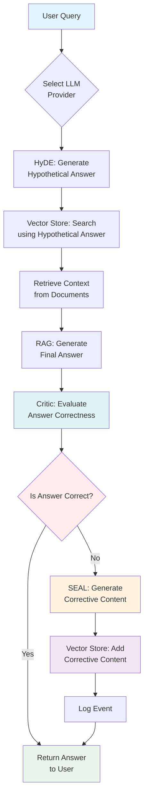
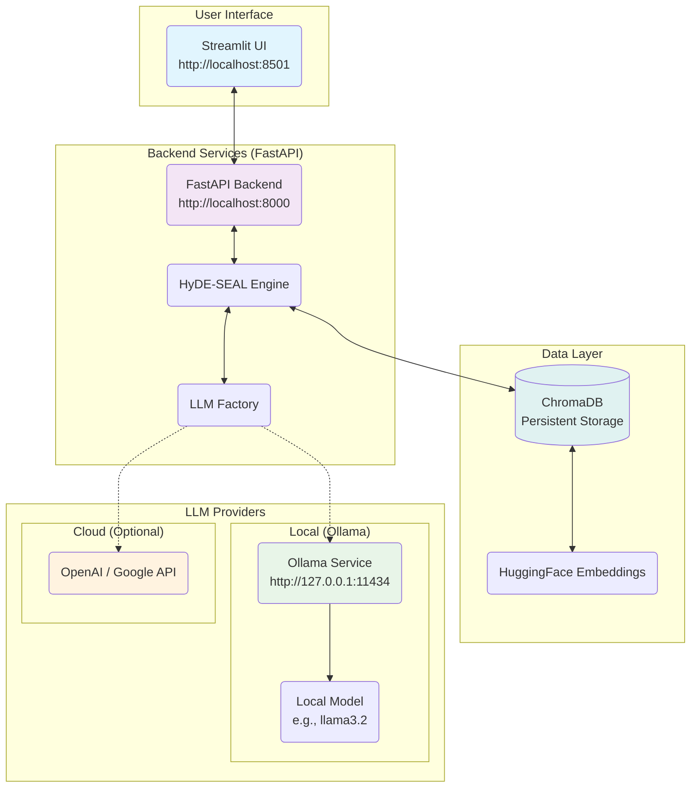

---

# 🧠 Reasona: A Self-Correcting RAG System (HyDE + SEAL Inspired)

<div align="center">

[](https://www.python.org/downloads/)
[](https://opensource.org/licenses/MIT)
[](https://langchain.com)
[](https://www.trychroma.com/)

</div>

<div align="center">


</div>

---

## Table of Contents

- [Project Definition](#project-definition)
- [Research Foundations](#research-foundations)
- [The Problem & Solution](#the-problem--solution)
- [System Flow](#system-flow)
- [Architecture](#architecture)
- [Features](#features)
- [Tech Stack](#tech-stack)
- [Installation](#installation)
- [Usage](#usage)
- [Project Structure](#project-structure)
- [Code Walkthrough](#code-walkthrough)
- [YouTube Walkthrough](#youtube-walkthrough)
- [License](#license)

---

## Project Definition

**Reasona** is a **Retrieval-Augmented Generation (RAG)** system designed to overcome the static nature of traditional RAG pipelines. Unlike systems that provide answers without evolving, Reasona implements a feedback loop for self-correction and persistent learning. It integrates principles inspired by **HyDE (Hypothetical Document Embeddings)** for enhanced retrieval and a simplified logic inspired by **SEAL (Self-Adapting Language Models)** to enable the system to learn from its own reasoning errors. The result is a RAG framework that not only retrieves and generates answers but also continuously refines its knowledge base based on its performance, aiming for improved accuracy over time.

---

## Research Foundations

This project draws inspiration from two key research papers:

*   **HyDE (Hypothetical Document Embeddings):** Based on ["Precise Zero-Shot Dense Retrieval without Relevance Labels" (Gao et al., 2022)](https://arxiv.org/abs/2212.10496). HyDE improves retrieval by generating a hypothetical answer to a query, embedding it, and using this embedding as the search query against the document corpus, often finding more relevant results than searching with the raw question.
*   **SEAL (Self-Adapting Language Models - Inspired Logic):** Inspired by ["Self-Adapting Language Models" (Zweiger et al., 2025)](https://arxiv.org/abs/2506.10943). While the original SEAL focuses on direct weight updates, Reasona implements a *knowledge-base update* mechanism, where corrective content is generated and persisted when errors are detected.

---

## The Problem & Solution

**The Problem:** Standard RAG systems are static. They retrieve information and generate answers based on their initial index. If they provide an incorrect answer, this error is not automatically corrected for future, similar queries, leading to persistent inaccuracies.

**The Solution (Reasona):** Introduces a feedback loop. The system generates answers, critically evaluates them, and if an error is detected, it creates corrective information (like improved text snippets or Q&A pairs) and adds it back to its vector store. This persistent update mechanism allows the system to learn from its mistakes and improve its future responses.

---

## System Flow

This diagram illustrates the internal process of Reasona for each query.



---

## Architecture

This diagram shows the high-level architecture of Reasona, including the user interface, backend API, data storage, and LLM providers.



---

## Features

| Aspect                  | Standard RAG | Reasona (HyDE + SEAL) |
| :---------------------- | :----------- | :-------------------- |
| Learns over time        | ❌ No        | ✅ Yes                |
| Fixes its own mistakes  | ❌ No        | ✅ Yes                |
| Works offline           | ❌ No        | ✅ Yes (Ollama)       |
| Persistent vector DB    | ⚠️ Optional  | ✅ Always-on (Chroma) |
| Transparency            | ❌ Black box | ✅ Shows sources + corrections |

---

## Tech Stack

*   **Backend:** [FastAPI](https://fastapi.tiangolo.com/)
*   **Frontend:** [Streamlit](https://streamlit.io/)
*   **RAG Framework:** [LangChain](https://python.langchain.com/)
*   **Vector Database:** [ChromaDB](https://www.trychroma.com/)
*   **Embeddings:** [HuggingFace Sentence Transformers](https://huggingface.co/sentence-transformers)
*   **LLM Interaction:** LangChain integrations (Ollama, OpenAI, Google)
*   **Configuration:** [Pydantic Settings](https://docs.pydantic.dev/latest/concepts/pydantic_settings/)

---

## Installation

### Prerequisites

*   Python 3.8 or higher
*   `pip` package manager
*   Git (optional, for cloning)

### 1. Clone the Repository

```bash
git clone https://github.com/ayushsyntax/Reasona.git
cd Reasona
```

### 2. Set Up Python Environment

It's recommended to use a virtual environment:

```bash
python -m venv venv
source venv/bin/activate # On Windows: venv\Scripts\activate
```

### 3. Install Python Dependencies

```bash
pip install -r requirements.txt
```

### 4. Install Ollama (For Local LLMs)

Ollama allows running LLMs locally. Follow the instructions on [https://ollama.ai](https://ollama.ai) for your operating system.

After installation, start the Ollama service:

```bash
ollama serve
```
Keep this terminal running.

Pull a model (e.g., `llama3.2`):

```bash
ollama pull llama3.2
```

### 5. Configure Environment Variables

Create a `.env` file in the project root:

```env
LLM_PROVIDER=ollama
MODEL_NAME=llama3.2
# OPENAI_API_KEY=your_openai_key_here  # Optional
# GOOGLE_API_KEY=your_google_key_here  # Optional
OLLAMA_HOST=http://localhost:11434
CHROMA_PATH=./data/chroma
UPLOAD_PATH=./data/uploads
```

---

## Usage

1.  **Start the Backend API:**

    ```bash
    python main.py
    ```
    The API will be available at `http://localhost:8000`.

2.  **Start the Streamlit UI (in a new terminal):**

    ```bash
    streamlit run ui.py
    ```
    The UI will be available at `http://localhost:8501`.

3.  **Interact:**
    *   Open the UI in your browser (`http://localhost:8501`).
    *   Upload documents (PDF, DOCX, TXT).
    *   Ask questions related to the uploaded documents.
    *   Observe the system's answer and retrieved context.
    *   If configured, you can switch between local (Ollama) and cloud (OpenAI/Google) models via the UI or `.env`.

---

## Project Structure

```
Reasona/
├── main.py                 # FastAPI backend entry point
├── ui.py                   # Streamlit frontend entry point
├── .env                    # Environment variables
├── requirements.txt        # Python dependencies
├── core/                   # Core application logic
│   ├── config.py           # Configuration loading
│   ├── models.py           # Data models (Pydantic)
│   ├── llm_factory.py      # LLM provider selection
│   ├── rag_engine.py       # HyDE-SEAL logic
│   └── vectorstore.py      # ChromaDB interaction
├── data/
│   ├── chroma/             # ChromaDB persistent storage
│   └── uploads/            # Temporary file uploads
└── README.md               # This file
```

---

## Code Walkthrough

*   **`main.py` (FastAPI Backend):** This file sets up the backend API server. It defines endpoints for uploading documents (`/upload`) and asking questions (`/query`). When a request comes in from the UI (`ui.py`), it calls the appropriate function in the `core/` folder to handle the logic.
*   **`ui.py` (Streamlit Frontend):** This file creates the user interface. It provides options to upload files and enter questions. It sends these inputs to the backend (`main.py`) using API calls and displays the results returned by the backend.
*   **`core/rag_engine.py`:** This is the core logic file. It implements the HyDE-SEAL cycle. It first uses HyDE to generate a hypothetical answer, then retrieves context from the vector store (`vectorstore.py`), generates a final answer using RAG, uses a critic function to check the answer, and if the answer is incorrect, it triggers the SEAL process to generate corrective content and update the vector store.
*   **`core/vectorstore.py`:** This file contains functions to interact with ChromaDB. It handles adding documents to the database during upload and searching for relevant documents during the query process.
*   **`core/llm_factory.py`:** This file acts as a factory for different LLM providers (Ollama, OpenAI, Google). Based on the configuration in `.env`, it returns the correct LangChain object to interact with the chosen LLM.

---

## YouTube Walkthrough

[Watch the video walkthrough here](https://youtu.be/AZ5MW70HFck) 
---

## License

This project is licensed under the MIT License. See the [LICENSE](LICENSE) file for details.

---