---

# 🧠 Reasona: Self-Correcting RAG (HyDE + SEAL)

<div align="center">

[](https://www.python.org/downloads/)
[](https://opensource.org/licenses/MIT)
[](https://langchain.com)
[](https://www.trychroma.com/)

</div>

---

## 🎥 YouTube Walkthrough

👉 **[Watch Demo on YouTube](https://youtu.be/AZ5MW70HFck)**

---

## What is Reasona?

A **Retrieval-Augmented Generation (RAG)** system that **learns from its mistakes**.

* Upload your PDFs, DOCX, or TXT files.
* Ask questions about *those* documents.
* Get answers grounded in your uploaded content.

**Key difference:**
Unlike standard RAG, Reasona **self-corrects** using ideas from:

* **HyDE** → Generates hypothetical answers to improve retrieval.
* **SEAL** → Learns from feedback to correct and store accurate info.

---

## System Flow


---

## Architecture Overview


---

## ✨ Features

| Feature                | Standard RAG | **Reasona** |
| :--------------------- | :----------: | :---------: |
| Learns from feedback   |       ❌      |      ✅      |
| Auto-corrects mistakes |       ❌      |      ✅      |
| Works offline (Ollama) |       ❌      |      ✅      |
| Persistent knowledge   |      ⚠️      |      ✅      |
| Shows sources          |       ❌      |      ✅      |

---

## 🧰 Tech Stack

<div align="center">
  
  
  
  
  
  
  
  
  
  
</div>

* **Backend Server (FastAPI):** Handles API requests (`/upload`, `/query`), manages communication between the UI and core logic.
* **Frontend UI (Streamlit):** Provides a simple web interface for users to upload documents and ask questions.
* **RAG Framework (LangChain):** Provides tools and abstractions for building the RAG pipeline (prompting, LLM calls, chains).
* **Vector Database (ChromaDB):** Stores document embeddings for fast similarity search. Persists both original documents and learned corrections.
* **Embeddings (HuggingFace):** Generates numerical representations (vectors) of text for the vector database using models like `all-MiniLM-L6-v2`.
* **AI Models (Ollama / OpenAI / Google):** Performs the core language understanding tasks (generating hypothetical answers, final answers, and critiques).
* **Config Management (Pydantic Settings):** Loads and validates environment variables (like API keys, model names) from the `.env` file.

---

## ⚙️ Installation

### 1. Clone Repository

```bash
git clone https://github.com/ayushsyntax/Reasona.git  
cd Reasona
```

### 2. Setup Environment

```bash
python -m venv venv
source venv/bin/activate  # Windows: venv\Scripts\activate
pip install -r requirements.txt
```

### 3. (Optional) Setup Ollama for Local LLM

```bash
ollama serve
ollama pull llama3.2
```

### 4. Create `.env`

```env
LLM_PROVIDER=ollama
MODEL_NAME=qwen3:1.7b
OLLAMA_HOST=http://localhost:11434
#OPENAI_API_KEY=your_openai_key_here
#GOOGLE_API_KEY=your_google_key_here
CHROMA_PATH=./data/chroma
UPLOAD_PATH=./data/uploads
```

---

## 🚀 Usage

```bash
# Terminal 1: Backend
python main.py
# Terminal 2: Frontend
streamlit run ui.py
```

Visit **[http://localhost:8501](http://localhost:8501)** → upload documents → ask questions.

---

## 📂 Project Structure

```
Reasona/
├── main.py                  # 🚀 FastAPI backend
├── ui.py                    # 💬 Streamlit frontend
├── .env                     # 🔐 Environment variables
├── requirements.txt          # 📦 Dependencies
│
├── core/                     # 🧠 Core logic
│   ├── config.py             # Load .env settings (Pydantic)
│   ├── models.py             # API schemas (Pydantic)
│   ├── llm_factory.py        # LLM provider factory (Ollama/OpenAI/Google)
│   ├── vectorstore.py        # ChromaDB + embeddings + chunking logic
│   ├── rag_engine.py         # HyDE + SEAL reasoning loop
│   └── ingest.py             # File extraction (PDF/DOCX/TXT)
│
├── data/                     # 📂 Persistent layer
│   ├── chroma/               # ChromaDB storage
│   └── uploads/              # Uploaded docs
│
├── README.md
└── LICENSE
```

---

## 🧩 File Workflow Diagram

```mermaid
graph TD
    subgraph "Frontend"
        UI[ui.py<br/>🧠 Streamlit Interface]
    end
    subgraph "Backend"
        API[main.py<br/>🚀 FastAPI Server]
    end
    subgraph "Core Logic"
        CFG[config.py<br/>⚙️ Load Settings]
        MOD[models.py<br/>📦 API Schemas]
        LLM[llm_factory.py<br/>🤖 LLM Selector]
        VDB[vectorstore.py<br/>💾 Chroma Manager]
        ING[ingest.py<br/>📚 File Parser]
        RAG[rag_engine.py<br/>🧩 HyDE-SEAL Engine]
    end
    subgraph "Data Layer"
        CHR[(ChromaDB Storage)]
        UPL[(Uploaded Files)]
    end
    UI -->|Upload File| API
    UI -->|Ask Question| API
    API -->|Call| ING
    API -->|Call| RAG
    API -->|Uses| MOD
    API -->|Reads| CFG
    RAG -->|Retrieve Docs| VDB
    RAG -->|Generate & Verify| LLM
    ING -->|Extract Text| UPL
    VDB -->|Store Embeddings| CHR
    RAG -->|If Wrong → Update| VDB
    LLM -.->|Ollama / OpenAI / Google| CFG
```



---

## 🔍 Code Walkthrough

### **`main.py` (Backend API)**

Handles FastAPI endpoints for uploading, querying, and managing requests asynchronously for low latency.

### **`ui.py` (Frontend UI)**

Streamlit-based interface for users to upload, query, and view results in chat format.

### **`core/rag_engine.py`**

Implements the full HyDE-SEAL reasoning loop — generates hypotheses, retrieves, verifies, and performs self-edits when needed.

### **`core/vectorstore.py`**

Manages persistent Chroma vector database with efficient text chunking using `RecursiveCharacterTextSplitter` (~1000 tokens, 150 overlap). Handles add, retrieve, and incremental learning updates.

### **`core/llm_factory.py`**

Chooses between Ollama (local), OpenAI, or Google models dynamically. Configurable from `.env`.

### **`core/ingest.py`**

Extracts text from PDFs, DOCX, and TXT files and sends them for embedding and storage.

---

## 🧠 Core Ideas Explained

* **HyDE (Hypothetical Document Embeddings):** Instead of searching the vector DB directly with your question ("What is X?"), Reasona first asks an LLM to generate a *possible answer* ("X is..."). This hypothetical answer is then embedded and used as the search query. This often retrieves more relevant documents than searching with the raw question.
* **SEAL (Self-Edit And Learn - Inspired Logic):** After generating an answer, Reasona uses another LLM call to *critic* the answer against the original question and retrieved context. If the critic finds the answer incorrect, Reasona triggers a SEAL process. This involves asking the LLM to generate corrective content (e.g., a better text snippet or a Q&A pair) based on the error. This new, correct information is then added back to the ChromaDB vector store, making the system's knowledge persistent and improving future responses.

---

## 🧭 Future Improvements

* Add structure-aware chunking to better handle complex formats like tables, code blocks, and markdown headings.
* Introduce hybrid retrieval (semantic + keyword) for higher context precision.
* Enhance metadata tracking — retain source filenames, sections, and page numbers for better provenance.
* Add context weighting based on recency and correction frequency to improve self-edit quality.
* Include evaluation metrics such as factual faithfulness, retrieval recall, and coherence.
* Expand to multi-turn reasoning and long documents.
* Support scalable, multi-user deployment with Docker and load balancing.
* Integrate optional human feedback for higher confidence validation.
* Extend to multimodal RAG (images, tables, charts) in future versions.

---

## 📚 Research References

* **HyDE (Hypothetical Document Embeddings):** ["Precise Zero-Shot Dense Retrieval without Relevance Labels"](https://arxiv.org/abs/2212.10496)
* **SEAL (Self-Adapting Language Models - Inspired Logic):** ["Self-Adapting Language Models"](https://arxiv.org/abs/2506.10943)

---

## 🧾 License

MIT © [**Ayush Syntax**](https://github.com/ayushsyntax)

---