# 🧠 Reasona: Self-Correcting RAG (HyDE + SEAL)

<div align="center">

[](https://www.python.org/downloads/)
[](https://opensource.org/licenses/MIT)
[](https://langchain.com)
[](https://www.trychroma.com/)

</div>

---

## 🎥 YouTube Walkthrough

👉 **[Watch Demo on YouTube](https://youtu.be/AZ5MW70HFck)**

---

## What is Reasona?

A RAG system that learns from its mistakes.

*   Upload your PDFs, DOCX, or TXT files.
*   Ask questions about *those* documents.
*   Get answers based on the content of your documents.

**The key difference:** Unlike standard RAG, Reasona **learns from its mistakes**. If it gives a wrong answer, it tries to correct itself and remembers the right information for next time. It uses ideas from research papers **HyDE** (for better searching) and **SEAL** (for learning from errors).

It's designed to understand and answer questions about *your* uploaded information, improving over time.

---

## System Flow

This diagram shows the steps Reasona takes when you ask a question.

```mermaid
graph TD
    A[You Ask: What is X?] --> B[HyDE: Generate Possible Answer<br/>X is...]
    B --> C[Search: Find docs similar to<br/>X is...]
    C --> D[RAG: Generate Final Answer<br/>using found docs]
    D --> E[Critic: Check Is the answer correct?]
    E --> F{Correct?}
    F -->|Yes| G[Show Answer ✅]
    F -->|No| H[SEAL: Create Correct Info<br/>Actually, X is Y]
    H --> I[Save: Add info to knowledge base]
    I --> G
```



---

## Architecture

This diagram shows the different parts of Reasona and how they connect.


---

## Features

| Feature                | Standard RAG | **Reasona** |
| :--------------------- | :----------: | :---------: |
| Learns from feedback   |       ❌      |      ✅      |
| Auto-corrects mistakes |       ❌      |      ✅      |
| Works offline (Ollama) |       ❌      |      ✅      |
| Persistent knowledge   |      ⚠️      |      ✅      |
| Shows sources          |       ❌      |      ✅      |

---

## Tech Stack

* **Backend Server:** FastAPI
* **User Interface:** Streamlit
* **RAG Framework:** LangChain
* **Vector Database:** ChromaDB
* **Text Embeddings:** HuggingFace
* **AI Models:** Ollama (Local) / OpenAI / Google
* **Configuration:** Pydantic Settings

---

## Installation

### 1. Clone Repository

```bash
git clone https://github.com/ayushsyntax/Reasona.git  
cd Reasona
```

### 2. Setup Environment

```bash
python -m venv venv
source venv/bin/activate  # On Windows: venv\Scripts\activate
pip install -r requirements.txt
```

### 3. Setup Ollama (Optional, for Local AI)

```bash
ollama serve
ollama pull llama3.2
```

### 4. Create `.env` File

Create a file named `.env` in the `Reasona` folder with these lines:

```env

LLM_PROVIDER=ollama
MODEL_NAME=qwen3:1.7b
OLLAMA_HOST=http://localhost:11434
#OPENAI_API_KEY=your_openai_key_here
#GOOGLE_API_KEY=your_google_key_here
CHROMA_PATH=./data/chroma
UPLOAD_PATH=./data/uploads


```

---

## Usage

```bash
# Terminal 1: Start Backend
python main.py
# Terminal 2: Start Frontend
streamlit run ui.py
```

→ Visit **[http://localhost:8501](http://localhost:8501)** in your browser.

Upload your documents → Ask questions about them.

---

## Project Structure

Here’s what each file does:

```
Reasona/
├── main.py                  # 🚀 FastAPI backend entry point
├── ui.py                    # 💬 Streamlit frontend app
├── .env                     # 🔐 Environment variables
├── requirements.txt          # 📦 Dependencies list
│
├── core/                     # 🧠 Core application logic
│   ├── config.py             # Centralized configuration (Pydantic Settings)
│   ├── models.py             # Request/response schemas (Pydantic models)
│   ├── llm_factory.py        # LLM provider factory (Ollama / OpenAI / Google)
│   ├── vectorstore.py        # ChromaDB manager + embeddings + chunking
│   ├── rag_engine.py         # HyDE + SEAL reasoning and feedback loop
│   └── ingest.py             # File extraction (PDF, DOCX, TXT)
│
├── data/                     # 📂 Persistent data layer
│   ├── chroma/               # ChromaDB vector storage
│   └── uploads/              # Uploaded documents
│
├── README.md                 # 📘 Project overview + instructions
└── LICENSE                   # ⚖️ MIT License
```

---

## Code Walkthrough

*   **`main.py` (FastAPI Backend):** This file sets up the backend API server. It defines endpoints for uploading documents (`/upload`) and asking questions (`/query`). When a request comes in from the UI (`ui.py`), it calls the appropriate function in the `core/` folder to handle the logic.
*   **`ui.py` (Streamlit Frontend):** This file creates the user interface. It provides options to upload files and enter questions. It sends these inputs to the backend (`main.py`) using API calls and displays the results returned by the backend.
*   **`core/rag_engine.py`:** This is the core logic file. It implements the HyDE-SEAL cycle. It first uses HyDE to generate a hypothetical answer, then retrieves context from the vector store (`vectorstore.py`), generates a final answer using RAG, uses a critic function to check the answer, and if the answer is incorrect, it triggers the SEAL process to generate corrective content and update the vector store.
*   **`core/vectorstore.py`:** This file contains functions to interact with ChromaDB. It handles adding documents to the database during upload and searching for relevant documents during the query process.
*   **`core/llm_factory.py`:** This file acts as a factory for different LLM providers (Ollama, OpenAI, Google). Based on the configuration in `.env`, it returns the correct LangChain object to interact with the chosen LLM.

---

## License

MIT © [Ayush Syntax](https://github.com/ayushsyntax)